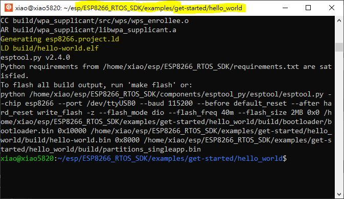
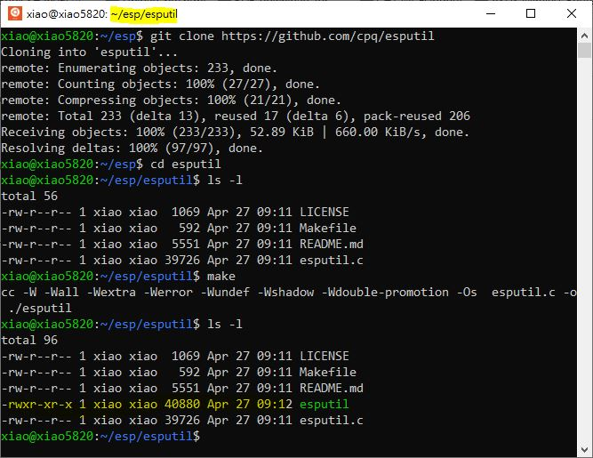
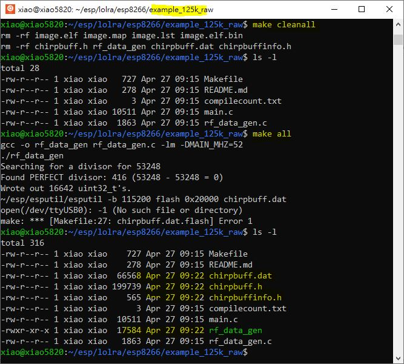

# lolra_ESP8266_testing
ESP8266 SDK and compile the code for testing, LoRa experiment without LoRa modem / radio chip

ref: https://github.com/espressif/ESP8266_RTOS_SDK

Linux is used (ie. ubutnu for Windows, WSL)  
### ESP8266_RTOS_SDK, tool chain setup,
```
mkdir esp
cd esp
git clone --recurse-submodules https://github.com/espressif/ESP8266_RTOS_SDK
export IDF_PATH=~/esp/ESP8266_RTOS_SDK
cd ~/esp/ESP8266_RTOS_SDK
sudo ./install.sh
. ./export.sh
cd ~/esp/ESP8266_RTOS_SDK/examples/get-started/hello_world
make menuconfig
make
```
  

### esputil, flash programming tool setup,  
```
cd ~/esp
git clone https://github.com/cpq/esputil
cd esputil
ls -l
make
```
  


### lolra, try to build the firmware,  
```
cd ~/esp
git clone --recurse-submodules https://github.com/cnlohr/lolra
cd lolra/esp8266/example_125k_raw
ls -l
make
ls- l
```
  

