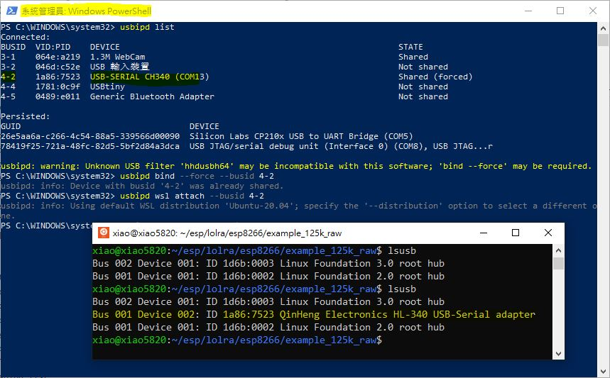
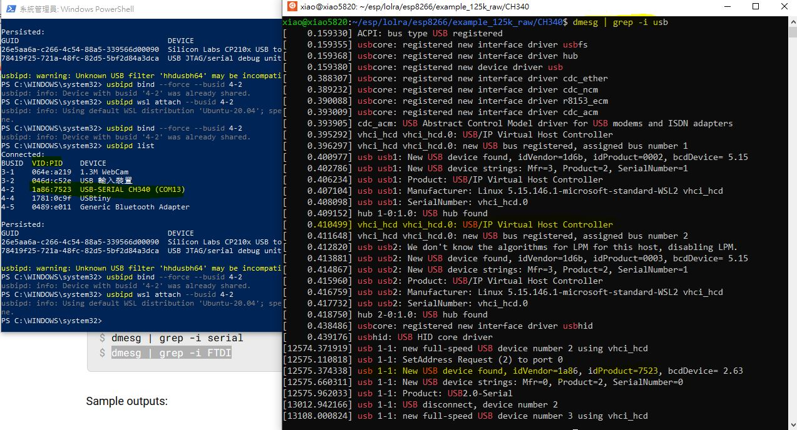

# lolra_ESP8266_testing
ESP8266 SDK and compile the code for testing, LoRa experiment without LoRa modem / radio chip

ref: https://github.com/espressif/ESP8266_RTOS_SDK

Linux is used (ie. ubutnu for Windows, WSL)  
### ESP8266_RTOS_SDK, tool chain setup,
```
mkdir esp
cd esp
git clone --recurse-submodules https://github.com/espressif/ESP8266_RTOS_SDK
export IDF_PATH=~/esp/ESP8266_RTOS_SDK
cd ~/esp/ESP8266_RTOS_SDK
sudo ./install.sh
. ./export.sh
cd ~/esp/ESP8266_RTOS_SDK/examples/get-started/hello_world
make menuconfig
make
```
  

### esputil, flash programming tool setup,  
```
cd ~/esp
git clone https://github.com/cpq/esputil
cd esputil
ls -l
make
```
  


### lolra, try to build the firmware,  
```
cd ~/esp
git clone --recurse-submodules https://github.com/cnlohr/lolra
cd lolra/esp8266/example_125k_raw
ls -l
make
ls- l
```
  


### WSL and com port setup
ref: https://learn.microsoft.com/en-us/windows/wsl/connect-usb, !!!note: microsoft doc & instruction was no complete correctness!!!  
ubuntu WSL must be open before this procedure !  

open powershell as admin, follow commands following (my esp8266 & com port is at CH340 / COM13, 'usbipd list' shows busid 4-2)  
```
usbipd list
usbipd bind --force --busid 4-2
usbipd wsl attach --busid 4-2
or
usbipd wsl detach --busid 4-2
```

WSL ubuntu command prompt, com13 mapped to USB bus 001 device 002
```
lsusb
dmesg | grep -i serial
dmesg | grep -i usb

```
  
  
